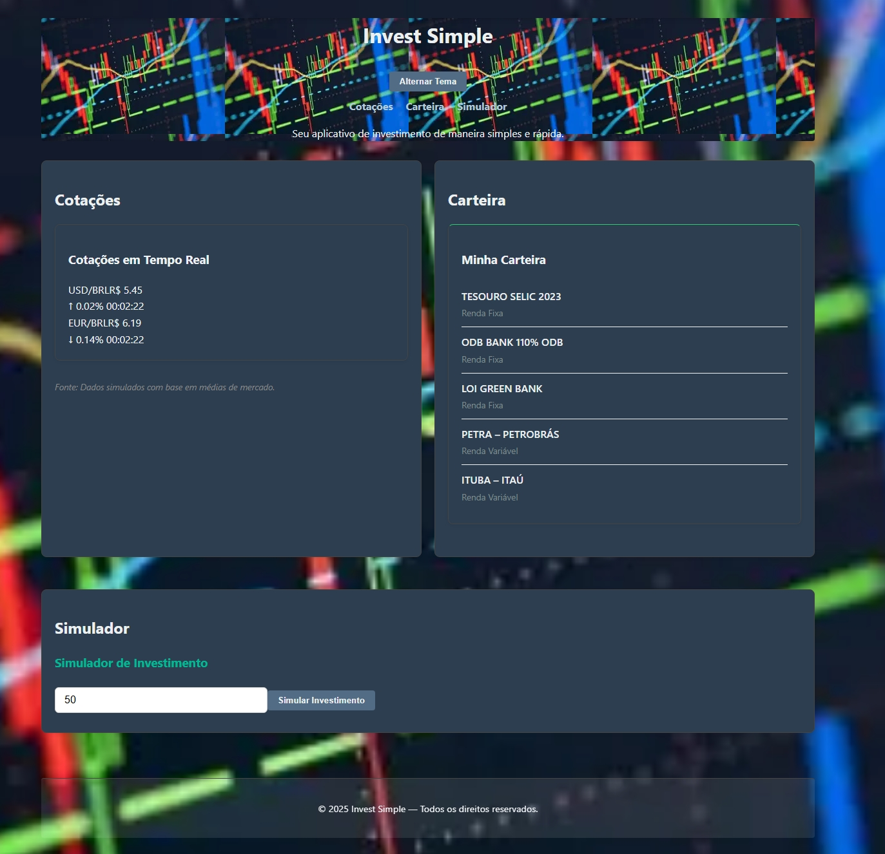

# Invest Simple 💰

Um aplicativo moderno para simulação de investimentos e acompanhamento de cotações em tempo real, desenvolvido com Vue.js 2 e Node.js.

## 📸 Demonstração



## 🚀 Funcionalidades

- **Cotações em Tempo Real**: Acompanhe USD/BRL, EUR/BRL e outros ativos
- **Simulador de Investimentos**: Calcule projeções de retorno
- **Carteira de Investimentos**: Visualize seus ativos organizados por categoria
- **Interface Responsiva**: Design moderno e adaptável para todos os dispositivos
- **Tema Claro/Escuro**: Alternância automática baseada no horário do dia

## 🛠️ Tecnologias

### Frontend
- Vue.js 2.7.14
- Vite 4.5.14
- Tailwind CSS 4.1.13
- JavaScript ES6+

### Backend
- Node.js
- Express.js 5.1.0
- CORS habilitado

## 📦 Instalação

### Pré-requisitos
- Node.js (versão 16 ou superior)
- npm ou yarn

### 1. Clone o repositório
```bash
git clone <url-do-repositorio>
cd invest-simples-app
```

### 2. Instale as dependências do frontend
```bash
cd frontend
npm install
```

### 3. Instale as dependências do backend
```bash
cd ../backend
npm install
```

## 🚀 Como executar

### Desenvolvimento

1. **Inicie o backend** (em um terminal):
```bash
cd backend
npm start
```
O backend estará disponível em: http://localhost:3001

2. **Inicie o frontend** (em outro terminal):
```bash
cd frontend
npm run dev
```
O frontend estará disponível em: http://localhost:5173

### Produção

1. **Build do frontend**:
```bash
cd frontend
npm run build
```

2. **Inicie o servidor de produção**:
```bash
cd frontend
npm run preview
```

## 📁 Estrutura do Projeto

```
invest-simples-app/
├── frontend/
│   ├── public/
│   │   └── images/          # Imagens e ícones
│   ├── src/
│   │   ├── components/      # Componentes Vue
│   │   │   ├── Carteira.vue
│   │   │   ├── Cotacoes.vue
│   │   │   └── Simulador.vue
│   │   ├── utils/           # Utilitários
│   │   │   └── calcularRetorno.js
│   │   ├── assets/          # CSS e fontes
│   │   ├── App.vue          # Componente principal
│   │   └── main.js          # Ponto de entrada
│   ├── index.html
│   └── package.json
├── backend/
│   ├── routes/
│   │   └── simulador.js     # Rotas da API
│   ├── server.js            # Servidor principal
│   └── package.json
└── README.md
```

## 🔧 Scripts Disponíveis

### Frontend
- `npm run dev` - Inicia servidor de desenvolvimento
- `npm run build` - Gera build de produção
- `npm run preview` - Visualiza build de produção

### Backend
- `npm start` - Inicia servidor de produção
- `npm run dev` - Inicia servidor com nodemon (desenvolvimento)

## 📊 API Endpoints

- `GET /api/cotacoes` - Retorna cotações em tempo real
- `GET /api/carteira` - Retorna dados da carteira
- `POST /api/simulador` - Processa simulações de investimento

## 🎨 Personalização

O projeto usa Tailwind CSS para estilização. Para personalizar:

1. Edite `frontend/src/assets/style.css`
2. Modifique os componentes Vue em `frontend/src/components/`
3. Ajuste as cores e temas em `frontend/src/App.vue`

## 🐛 Solução de Problemas

### Erro 404
- Verifique se o servidor backend está rodando na porta 3001
- Confirme se o frontend está acessando a porta correta (5173)

### Dependências
- Execute `npm install` em ambas as pastas (frontend e backend)
- Verifique se o Node.js está na versão correta

### Portas ocupadas
- O Vite automaticamente tentará a próxima porta disponível
- Para forçar uma porta específica, edite `vite.config.js`

## 🤝 Contribuição

1. Faça um fork do projeto
2. Crie uma branch para sua feature (`git checkout -b feature/AmazingFeature`)
3. Commit suas mudanças (`git commit -m 'Add some AmazingFeature'`)
4. Push para a branch (`git push origin feature/AmazingFeature`)
5. Abra um Pull Request

## 📝 Licença

Este projeto está sob a licença MIT. Veja o arquivo `LICENSE` para mais detalhes.

## 👨‍💻 Desenvolvido por

Manoela - Invest Simple App

---

**Nota**: Este é um projeto de demonstração para fins educacionais. Para uso em produção, considere implementar autenticação, validação de dados e testes automatizados.
